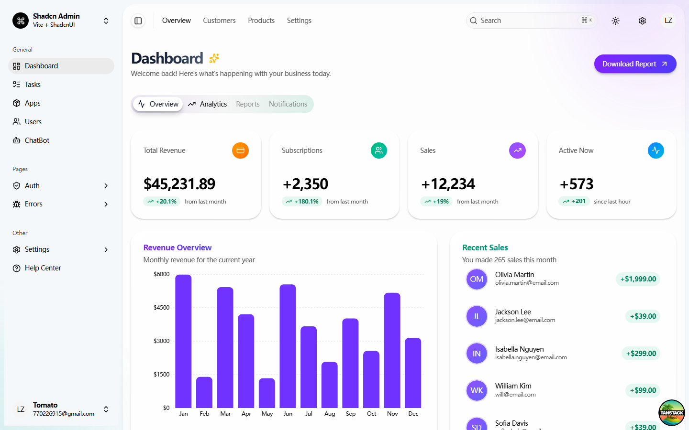
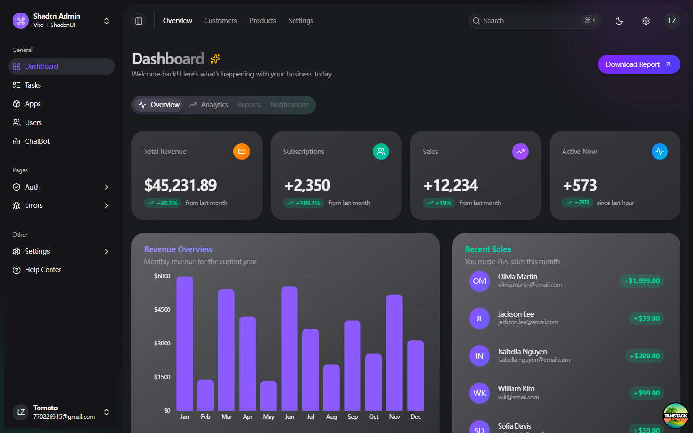

<div align="center">

# React SSE Admin

基于 TanStack Start、React 19 与 Vite 7 打造的现代化后台模板，集成路由、数据获取、表单、表格与多主题布局，为中大型 BFF/SSR 场景提供开箱即用的脚手架。

</div>

## 界面预览

本项目支持亮色和暗色两种主题模式，提供一致的用户体验。

<picture>
  <source media="(prefers-color-scheme: dark)" srcset="public/dark-dashboard.png">
  
</picture>

### 亮色主题


### 暗色主题


## 技术栈一览

- **运行时**：React 19 + Vite 7（SSR & Streaming ready）
- **路由**：TanStack Router 文件路由，自动生成 `routeTree`
- **数据层**：TanStack Query 5 + `@tanstack/react-router-ssr-query`
- **表单**：TanStack React Form、React Hook Form Resolver、Zod
- **表格 & 列表**：TanStack Table 8 + 自定义 DataTable 组件
- **状态管理**：Zustand 搭配 Cookie 工具管理鉴权态
- **UI 与样式**：Radix UI 原子组件 + shadcn 风格 + Tailwind CSS 4 + 自定义主题系统

## 功能亮点

1. **多布局与主题**：`src/context` 中的 Direction/Theme/Layout Provider 支持亮/暗/系统主题、左右布局切换与密度控制。
2. **鉴权流程完整**：`src/features/auth` 覆盖登录、注册、OTP、忘记密码，并与 `stores/auth-store.ts` 联动 Cookie。
3. **任务、用户、设置等模块示例**：`src/features/*` 与 `src/routes/_authenticated/*` 展示真实业务拆分方式。
4. **数据驱动的组件库**：`src/components/data-table`、`components/form` 等为通用中后台组件，易于复用。
5. **SSR 友好的数据获取**：Query Client 通过 `integrations/tanstack-query` 统一创建，并由 Router Context 向下传递，确保首屏命中缓存。
6. **开发体验**：严格的 TS 配置、ESLint/Prettier、Vitest + Testing Library、`@/` 路径别名，保证代码一致性。

## 快速开始

> 需要 Node.js ≥ 20 与 PNPM ≥ 10（已在 `packageManager` 中锁定版本）

```bash
# 安装依赖
pnpm install

# 启动开发服务器 (http://localhost:9527)
pnpm dev

# 生产构建与本地验证
pnpm build
pnpm serve
```

## NPM Scripts

| 命令 | 说明 |
| --- | --- |
| `pnpm dev` | 启动 Vite 开发服务器（端口 9527，支持 HMR & SSR） |
| `pnpm build` | 生成 SSR + 客户端产物 |
| `pnpm serve` | 以生产模式本地预览 |
| `pnpm test` | 运行 Vitest（含 JSDOM 环境与 Testing Library） |
| `pnpm lint` | 使用 `@tanstack/eslint-config` 检查全量代码 |
| `pnpm format` | 使用 Prettier 格式化 |
| `pnpm check` | 先 `prettier --write` 再 `eslint --fix` 的一键校验 |

## 目录结构

```
src/
├─ assets/           # 品牌图标、Logo 与 SVG
├─ components/       # UI 原子与复合组件（含通用 DataTable/Form）
├─ context/          # Theme/Direction/Layout/Search Providers
├─ features/         # 业务模块（auth、dashboard、tasks、users...）
├─ hooks/            # 响应式工具钩子
├─ integrations/     # 第三方集成（例如 TanStack Query）
├─ lib/              # 工具库（cookies、utils、mock helper）
├─ routes/           # TanStack Router 文件路由（含 auth/errors 分区）
├─ stores/           # Zustand 状态（如鉴权 Store）
├─ styles.css        # Tailwind 入口与全局样式
├─ router.tsx        # Router 工厂与 SSR Query 接入
└─ routeTree.gen.ts  # 由 `@tanstack/router-plugin` 生成
```

## 架构与关键约定

### 路由与页面组织

- `src/routes/__root.tsx` 提供全局布局、导航与 Devtools。
- `_authenticated`、`(auth)`、`(errors)` 等目录代表不同的 route segments。
- 通过 `@tanstack/router-plugin` 自动生成 `routeTree.gen.ts`，在 `router.tsx` 中加载：

```9:28:src/router.tsx
export const getRouter = () => {
  const rqContext = TanstackQuery.getContext()
  const router = createRouter({
    routeTree,
    context: { ...rqContext },
    defaultPreload: 'intent',
    Wrap: (props) => (
      <TanstackQuery.Provider {...rqContext}>{props.children}</TanstackQuery.Provider>
    ),
  })
  setupRouterSsrQueryIntegration({ router, queryClient: rqContext.queryClient })
  return router
}
```

### 数据获取策略

- `src/integrations/tanstack-query/root-provider.tsx` 统一创建 QueryClient，设置 SSR 友好的 `staleTime`、`gcTime` 与默认行为。
- Router 使用 `@tanstack/react-router-ssr-query` 自动回填 Query 缓存，避免客户端二次请求。
- 业务侧可在 Route Loader 中进行 Prefetch，或在组件里直接使用 React Query/TanStack Form。

### 表单与校验

- `src/components/form` 抽象了字段、提示、错误展示，与 `@tanstack/react-form` 深度集成。
- `@hookform/resolvers` + Zod 负责复杂表单规则，`features/auth` 内含多种用例（OTP、密码重置、注册）。

### 表格与数据呈现

- `src/components/data-table` 基于 TanStack Table，提供列排序、筛选、批量操作、视图切换、分页等能力。
- `features/tasks`、`features/users` 展示如何复用 DataTable 与筛选器。

### 状态与持久化

- `stores/auth-store.ts` 使用 Zustand + Cookie 工具保持登录态，暴露 `auth.setUser / setAccessToken / reset` 等方法，页面可通过 hook 读取。
- `src/lib/cookies.ts` 封装读写 Cookie，便于 SSR/浏览器环境共用。

### 样式与主题

- Tailwind CSS 4 + `@tailwindcss/vite`；在 `styles.css` 注册基础 layer。
- 组件结合 Radix UI Primitive 与 shadcn 设计语言，配套 `tailwind-merge` 与 `class-variance-authority` 处理动态 class。
- `context/theme-provider.tsx` 使用 `next-themes` 支持系统主题、亮/暗模式切换；`context/layout-provider.tsx` 管理 Sidebar/Content 形态。

### 工程规范

- TypeScript `strict`、`noUnused*`、`noUncheckedSideEffectImports`，并通过 `@/` 别名缩短引用。
- ESLint + Prettier 作为强制规范，`pnpm check` 可一键修复。
- Vitest + Testing Library（`@testing-library/react`）可对组件进行 DOM 级断言，建议结合 Story 或 Play 进行交互测试。

## 开发建议

1. 新增路由：在 `src/routes` 下创建文件/目录 → 运行开发服务器时会自动更新 `routeTree.gen.ts`。
2. 扩展数据层：在 Loader 中使用 `context.queryClient` 做首屏数据注水，组件内直接使用 `useQuery` 读取。
3. 拓展 UI：统一在 `src/components` 或特定 `features/*/components` 下新增，复用已有的设计令牌与主题。
4. 集成 API：推荐在 `src/features/*/data` 中集中管理请求 & mock，方便切换真实端点。

## 测试与质量

- 单元/组件测试：`pnpm test`
- Lint：`pnpm lint`
- 统一修复：`pnpm check`

在 CI 中建议分阶段执行（Lint → Test → Build）以更快暴露问题。

#### 自动部署流程

配置完成后，每次你：

- ✅ 推送到 `main` 分支 → 自动构建并部署到 GitHub Pages
- ✅ 合并 Pull Request → 自动更新网站
- ✅ 手动触发 → 在 Actions 页面点击 "Run workflow"

#### 注意事项

- ⚠️ **GitHub Pages 仅支持静态站点**：本项目会构建为静态站点（SPA 模式）
- ⚠️ **Base 路径**：已自动配置为仓库名路径，确保路由正常工作
- ⚠️ **首次部署**：可能需要几分钟时间，请耐心等待

### 手动部署

如果需要手动部署：

```bash
# 构建项目
pnpm build

# 部署到 gh-pages 分支（需要安装 gh-pages）
npx gh-pages -d dist
```

### 其他部署平台

如果需要 SSR 功能，可以考虑：

- **Vercel**：支持 SSR，自动检测 TanStack Start
- **Netlify**：支持 SSR，需要配置构建命令
- **Cloudflare Pages**：支持 SSR，需要 Worker 配置

## 常见问题

- **Router 未更新**：确保运行 `pnpm dev`（或 `pnpm tanstack router:codegen`）以重新生成 `routeTree.gen.ts`。
- **Query 未命中缓存**：确认在 Loader 中使用 `context.queryClient` 进行 `prefetchQuery`，并启用 `setupRouterSsrQueryIntegration`。
- **主题不生效**：检查 `ThemeProvider` 是否包裹在布局外层，或浏览器是否禁用了 `localStorage`/`matchMedia`。

如需更多信息，可查阅 TanStack 官方文档、Radix UI 与 Tailwind 指南，或直接浏览 `src/features` 获取参考实现。祝开发顺利！
